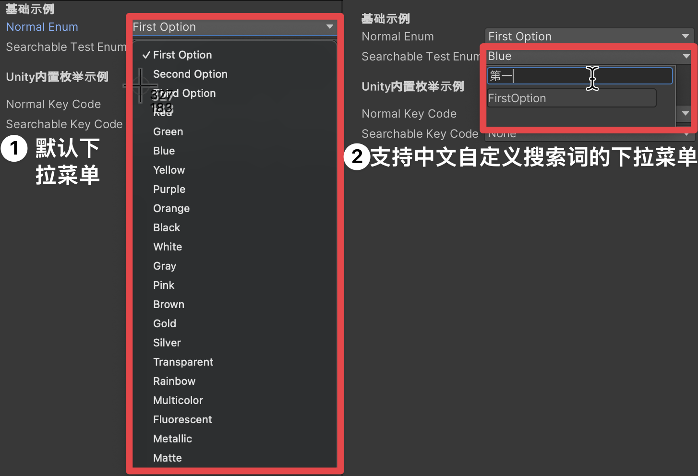
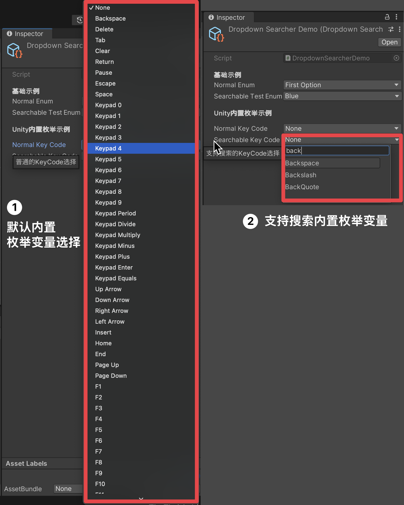

# UnityDropdownSearcher 编辑器拓展

在 Unity 开发中，下拉菜单是常用的 UI 组件，但当选项过多时，找到想要的选项就变得非常麻烦。为了解决这个问题，我们开发了 UnityDropdownSearcher 扩展，给下拉菜单加上了搜索功能，特别是支持中文搜索，方便开发者快速定位选项。

## 解决了什么问题？
- **选项太多，找起来费劲**：当下拉菜单里有几十甚至上百个选项时，手动滚动查找效率太低。
- **中文支持不足**：很多项目需要用到中文选项，但 Unity 默认的下拉菜单对中文支持不够友好。

## 怎么用？

### 1. 自定义搜索词
通过 `[SearchText("自定义搜索词")]` 特性，可以为每个枚举值指定一个或多个搜索词，支持中文。比如：

```csharp
using ShawnHu.DropdownSearcher;

public class Example : MonoBehaviour
{
    [Tooltip("普通的枚举下拉框")]
    public TestEnum NormalEnum;
        
    [Tooltip("支持搜索的枚举下拉框")]
    [SearchableEnum]
    public TestEnum SearchableTestEnum;
}

public enum TestEnum
{
    [SearchText("第一个选项 First Option")]
    FirstOption,
    
    [SearchText("第二个选项 Second Option")]
    SecondOption,
    
    [SearchText("第三个选项 Third Option")]
    ThirdOption,
}
```
 

### 2. 支持 Unity 默认枚举
Unity 自带的枚举类型也可以直接使用搜索功能。比如：

```csharp
using UnityEngine;
using ShawnHu.DropdownSearcher;

public class Example : MonoBehaviour
{
    [Tooltip("普通的KeyCode选择")]
    public KeyCode NormalKeyCode;
        
    [Tooltip("支持搜索的KeyCode选择")]
    [SearchableEnum]
    public KeyCode SearchableKeyCode;
}
```
 


## 如何安装 UnityDropdownSearcher 包？

可以通过 Unity Package Manager (UPM) 直接安装，或者手动导入包。

### 方法一：通过 Git URL 安装

1. 打开 Unity 项目。

2. 打开 Package Manager：在 Unity 编辑器中，点击 `Window` > `Package Manager`。

3. 添加包：在 Package Manager 窗口左上角，点击 `+` 按钮，选择 `Add package from git URL...`。

4. 输入 Git URL：在弹出的对话框中，输入以下 URL，然后点击 `Add`。
```
https://github.com/ShawnHu0815/UnityDropdownSearcher.git
```

5. 等待导入：Unity 会自动从 GitHub 下载并导入 UnityDropdownSearcher 包，导入完成后就可以使用了。

### 方法二：手动导入 .unitypackage

1. 下载包：访问 [Releases 页面](https://github.com/ShawnHu0815/UnityDropdownSearcher/releases)，下载最新版本的 `.unitypackage` 文件。

2. 导入包：在 Unity 编辑器中，点击 `Assets` > `Import Package` > `Custom Package...`，选择下载好的 `.unitypackage` 文件。

3. 选择导入内容：在弹出的窗口中，勾选所有内容，点击 `Import` 完成导入。

## 开始使用

导入完成后，就可以在项目中使用 UnityDropdownSearcher 的功能了。具体用法可以参考上面的示例代码，或者直接试试看效果。